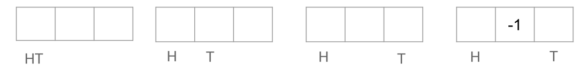

# Testing linearizability with Lincheck

*By [Alexandru Dumtiriu](https://github.com/Alexandru-Dumitriu)
and [Bob Brockbernd](https://github.com/bbrockbernd)*.

# Introduction

We leverage a novel tool, Lincheck, to test popular libraries that use concurrency. Our experiments on certain data structures impelmented in these libraries have led to several interesting findings, both related to the tested frameworks and Lincheck itself. Our main objective in this project is to identify at least one bug in the tested libraries and report it to the developers responsible for maintaining them.

## Linearizability

In their paper ["Linearizability: a correctness condition for concurrent objects"](https://cs.brown.edu/~mph/HerlihyW90/p463-herlihy.pdf), Herlihy and Wing introduce a key criterion for evaluating the correctness of concurrent object implementations. The basic idea is to ensure that although an implementation may not demonstrate every possible interleaving permitted by linearizability, every realized interleaving must comply with the linearizability principle [1]. This means that all operations, regardless of their concurrency, must seem atomic or instantaneous from an external perspective. This strict requirement guarantees the integrity and dependability of concurrent systems, preventing unexpected behaviors or inconsistencies in concurrent operations.


## Sources of non-determinism

Concurrency in programming can be challenging due to non-determinism, especially delays, which can cause errors. Testing data structures can be even more complicated, making it difficult to identify bugs. Stress testing is a common approach, but it is often unable to detect elusive bugs caused by non-determinism. In addition, when different threads access the same data concurrently, an operation that spans multiple instructions in one thread can result in erroneous outcomes if it lacks atomicity. While tools like Lincheck can provide insights into the proximity to linearizability, they cannot guarantee it. Nevertheless, a successful test can boost confidence in the concurrency model's fidelity under real-world scenarios.

# What is Lincheck?

[Lincheck](https://github.com/JetBrains/lincheck) is a robust tool designed to facilitate concurrent testing and verification of thread-safe code. It seamlessly integrates with existing Java or Kotlin code, providing an easy-to-use framework for ensuring the correctness and reliability of concurrent algorithms and data structures.

At its core, Lincheck leverages state-of-the-art techniques to systematically explore the behaviour of concurrent executions. It can simulate various concurrency scenarios, such as multiple threads accessing shared resources concurrently or executing complex transactional operations. The tool meticulously monitors these executions, detecting potential race conditions, data races, and other concurrency bugs. It employs sophisticated algorithms to explore different interleavings of thread executions systematically, aiming to uncover subtle concurrency issues that may arise under specific scheduling conditions.

By utilizing the capabilities of Lincheck, we can conduct tests on some of the most commonly used Java concurrent libraries to confirm their linearizability through the model-checking functionality. If no problems are detected, we can confidently declare that the possibility of concurrency bugs occurring in practical situations is extremely low. However, if any issues are found, we aim to report them, so that they can be fixed in future versions of the libraries being tested.

## The bug detection technique
Lincheck tests for linearizability of datastructures in a three step process. This is done by first randomly creating a set of concurrent scenarios, then executing each concurrent scenario in different orders and lastly verifying that each execution is linearizable.

### Generate
We provide lincheck with a set of operations that can be performed on the datastructure under test. For instance, a concurrent queue has operations like `poll()`, `peek()` and `add()`. Lincheck will then generate concurrent scenarios, sort of little multithreaded programs. By default, lincheck generates 100 of such scenarios per test.

| Thread 1 | Thread 2 | 
|----------|----------|
| poll()   | add()    |
| add()    | peek()   |
|          | add()    |


### Execute
Each of the generated concurrent little program is then executed 10.000 times. Lincheck has two strategies for this phase: _Stress_ and _Model Check_.

A stress test executes each program over and over, relying on the non-determinism of the scheduler. The model checker instruments the java bytecode to control context switches of the threads. Basically allowing lincheck to choose and explore execution schedules.

Then lincheck records all the outputs of all the operations. For instance, a `poll()` can return a value or null, and `add()` returns true or false if the operation was successful or not. 

| Thread 1     | Thread 2     | 
|--------------|--------------|
| poll(): 1    | add(1): true |
| add(2): true | peek(): 2    |
|              | add(3): true |


### Verify
After in total one million executions, Lincheck verifies each found execution by looking for a sequential execution that could lead to the outcomes of this specific concurrent execution.

| Thread 1     | Thread 2     | 
|--------------|--------------|
|              | add(1): true |
| poll(): 1    |              |
| add(2): true |              |
|              | peek(): 2    |
|              | add(3): true |


## Test Setup

For the tests we use a Windows 11 and a macOS machine with 16 and 64 gb of RAM. This allows us to test the selected data structures in complex scenarios, leveraging up to 16gb of JVM memory.

We use the latest version of all libraries tested and Lincheck as of 17th of April 2024.

Another important aspect we took into account was the configuration we ran Lincheck with. After consulting with the author, we decided to run it with the basic parameters as these would suffice our testing needs.

## Bug Injection Test

In order to showcase how Lincheck works in a very simple setting and to prove that it easily detects the appearance of a bug, we will test java.util.concurrent.ConcurrentLinkedQueue and we will also test a version of it in which we inject a bug.

## The bug

We copy the implementation of ConcurrentLinkedQueue and we modify the method with which you add a new value to the queue. The current implementation uses CAS(compareAndSet) to update the next pointer between nodes. This ensures that the operation is atomic and the node that creates the connection is not deleted by a thread in the meantime. By changing this to a much simpler if then statement that is not atomic we inject the bug.

```kotlin
//  if (NEXT.compareAndSet(p, null, newNode)) {
    if (p.next == null) {
        p.next = newNode
    }
```

# The experiment result

By running the data structure from java.util we are not able to find any bugs and the test passes in around 2 minutes. On the other side, running the implementation with the injected bug leads to a test failure in around 10 seconds due to the non-atomicity of the add operation, allowing the linking with a node previously removed.


# Related Work

Lincheck is a tool used for checking linearizability and other concurrency properties, being remarkable for its user-friendliness [2]. Compared to other similar tools like [JCStress](https://github.com/openjdk/jcstress), CHESS (Line-Up), and [GenMC](https://github.com/MPI-SWS/genmc), Lincheck stands out due to its exceptional ease of use. JCStress, while offering robust capabilities, can be challenging for users due to its non-declarative nature [3]. CHESS (Line-Up) is tailored for C# environments and uses Bounded Model Checking to verify properties like linearizability in a very similar manner to Lincheck [4]. GenMC has advanced features, but its ease of expansion is a drawback, which Lincheck is addressing by integrating the GenMC algorithm into its system [5]. Lincheck's most significant strength lies in its accessibility and simplicity. Its straightforward interface and streamlined process empower users to assess linearizability effortlessly without needing to deal with steep learning curves or intricate configurations. In the field of concurrent systems, where precision and efficiency are critical, Lincheck's user-friendly approach makes it an excellent choice for those seeking seamless verification.

# Results

We have selected and tested 4 opensource libraries that provide concurrent datastructures for the JVM.

## Guava
[Guava](https://github.com/google/guava) is a Java library developed and maintained by Google. It provides additional collection types and utilities. In particular, it provides the following concurrent data structures:

- AtomicDoubleArray
- AtomicDouble
- ConcurrentHashMultiset

In the `ConcurrentHashMultiset` we discovered a bug. A Multiset is a set that accepts multiple occurrences of the same value. As shown in the figure below this non linearizable execution occurs when an added value gets removed simultaneously, and on one thread a setCount operations is executed. The `setCount(element, oldCount, newCount)` operation is an operation that for an `element` compares the current value with `oldValue` and if true replaces the value with `newCount`.

As you can see in Thread 2 a remove operation is performed and returns false, meaning that there was no value to be removed and thus the count for element _a_ is 0. The only valid sequential execution for the first three operations is the following: 

| Thread 1         | Thread 2                 | 
|------------------|--------------------------|
| add(a): true     |                          |
| remove(a) : true |                          |
|                  | remove(a): false         |
|                  | setCount(a, 0, 1): false |

However, with the 4th operation this is not sequentially consistent. There is no other option than that the counter is 0 and `setCount` should update and return true. Or in other words if `setCount(a, 0, 1)` returns false, that means that the set is not empty for _a_. Which is inconsistent with `remove(a): false)` and only one item has been added before the concurrent part started.

How can this happen you ask? The multiset is under the hood implemented as a `ConcurrentHashMap` where the keys are the elements of the set and the values are how often this element occurs in the set. In the remove function of `ConcurrentHashMultiset` is a check that removes the the key value entry from the map when the counter reaches 0. This cleaning operation makes sense, otherwise longlasting multisets could keep growing the underlying hashmap.
```java
 if (newValue == 0) {
    countMap.remove(element, existingCounter);
}
```

However this remove operation can interfere with the way the `setCount` operation works. This `setCount` first makes a `putIfAbsent` call to place the element in the map if. If there was not a value before we return null, however if there was a value before we perform a replace action where we replace the old counter with the new counter. This is un unironically to prevent data races, where the old value might have changed and we dont want to override a change that has been made.
```java
return (countMap.putIfAbsent(element, newCounter) == null)
        || countMap.replace(element, existingCounter, newCounter);
```

In the case of this specific execution, it is possible that the `remove` action removes the key value pair inbetween the `putIfAbsent` and `replace` which would in turn return false. And thus resulting in the non linearizable execution we found.

## Multiverse

Multiverse is a powerful Java concurrency library that simplifies the development of multithreaded applications. It comes equipped with a range of tools including atomic variables, lock-free data structures, and fine-grained locking mechanisms. The standout feature of Multiverse is its software transactional memory (STM), which ensures data consistency by encapsulating operations within transactions. This means that operations are either committed as a whole or rolled back in case of failure, similar to database transactions. By using this approach, Multiverse minimizes contention and simplifies complex concurrent operations. This level of control over shared data allows developers to create scalable, error-resilient applications, reducing the risks associated with race conditions and deadlocks that often occur in concurrent programming.

### TxnInteger

In order to test the correctness of this data structure we passed as operations to Lincheck the methods for incrementing and decrementing. Since these operations are implemented to be atomic we were not expecting to find any bugs, but, surprisingly we discovered a bug in Lincheck and we notified the developer about it.


### TxnRef

Similarly to TxnInteger we approached TxnRef and we did not encounter any bugs from either Lincheck or the data structure, obtaining a test pass that means that the operations used(set, get) are atomic and lead to a linearizable implementation.

## FastUtil

FastUtil is a Java library that provides fast and memory-efficient implementations of various collection classes, such as lists, sets, maps, and priority queues. It is designed to offer improved performance as compared to the standard Java collections framework by utilizing specialized data structures and optimized algorithms. FastUtil emphasizes minimal memory overhead and high performance, making it particularly well-suited for scenarios where performance is critical, such as large-scale data processing or high-throughput applications. The library is widely used in projects requiring efficient data structures and algorithms in Java.

### BigArrays
Despite the emphasis on performance, there are few data structures that utilize concurrency, and most of them can be challenging to set up correctly. Therefore, we tested only one data structure, called BigArrays, which uses a matrix to represent a very large array. However, we conducted more complex tests by testing BigArrays on two types of data, Integer and AtomicInteger. We also tested all available operations, such as set, get, add, multiply, increment, and decrement, leading to longer tests that interleave most permutations of these operations. Nevertheless, this test did not uncover any bugs in the implementation, but it took twice as long as simpler tests with fewer operations. This indicates that Lincheck's completion time is directly proportional to the number of operations considered.

## Agrona
Agrona is a library supporting fast and scalable concurrent systems. This library has some concurrent datastructures as well:

- OneToOneArrayQueue
- ManyToOneArrayQueue
- ManyToManyArrayQueue

OneToOne meaning one producer and one consumer, in other words one thread on the reading side and one thread on the writing side etc.

These datastructures have some non-linear executions as well, one having to do with their poll (and similarly peek) operations and one to do with the drain operation.

### Poll
In the illustration below in Thread 1 you can see that there is an offer() which is successful and afterwards a poll operation that fails. While in the rest of the program there are no other poll operations. This is no sequentially consistent.


What happened? The offer operation first increments the tail position (which keeps track of the end of the queue) and then places the value. This does not happen atomically. This allows for the following execution:

- First an empty queue with head and tail at the same position
- Second, Thread 2 starts offering a value and increments tail
- Third, Thread 1 starts offering and increments tail again (now has value 2)
- Fourth, Thread 1 places value at position 1.

Now it becomes clear that thread one can place a value (which happens to not be at the first position) and than fails to poll a value.



Now to be fair, the documentation of Agrona states that the poll operations can be sequentially inconsistent when an offer is still in progress. They prefer to return null over busy waiting, which can be a valid design choice in high throughput scenarios.

### Drain
According to the documentation the drain operation is an operation that polls all values from the queue which are in the queue from the moment it started.

Where we directly see a problem is that the queue in the tests is defined to have a length of 3. However this drain returns 4 values. The only explanation is that value can be added while the drain is in progress. 


# Conclusion

TODO

# References

1. Herlihy, M.P., Wing, J.M.: Linearizability: a correctness condition for concurrent objects. ACM Trans. Program. Lang. Syst. (TOPLAS) 12(3), 463–492 (1990)
2. Koval, N., Fedorov, A., Sokolova, M., Tsitelov, D., Alistarh, D. (2023). Lincheck: A Practical Framework for Testing Concurrent Data Structures on JVM. In: Enea, C., Lal, A. (eds) Computer Aided Verification. CAV 2023. Lecture Notes in Computer Science, vol 13964. Springer, Cham. https://doi.org/10.1007/978-3-031-37706-8_8
3. The Java Concurrency Stress tests. https://openjdk.java.net/projects/code-tools/jcstress
4. Musuvathi, M., Qadeer, S.: Iterative context bounding for systematic testing of multithreaded programs. SIGPLAN Not. 42(6), 446–455 (2007)
5. Kokologiannakis, M., Vafeiadis, V.: GenMC: a model checker for weak memory models. In: Silva, A., Leino, K.R.M. (eds.) CAV 2021. LNCS, vol. 12759, pp. 427–440. Springer, Cham (2021). https://doi.org/10.1007/978-3-030-81685-8_20


Our implementation is available on [GitHub](https://github.com/bbrockbernd/MultTest).